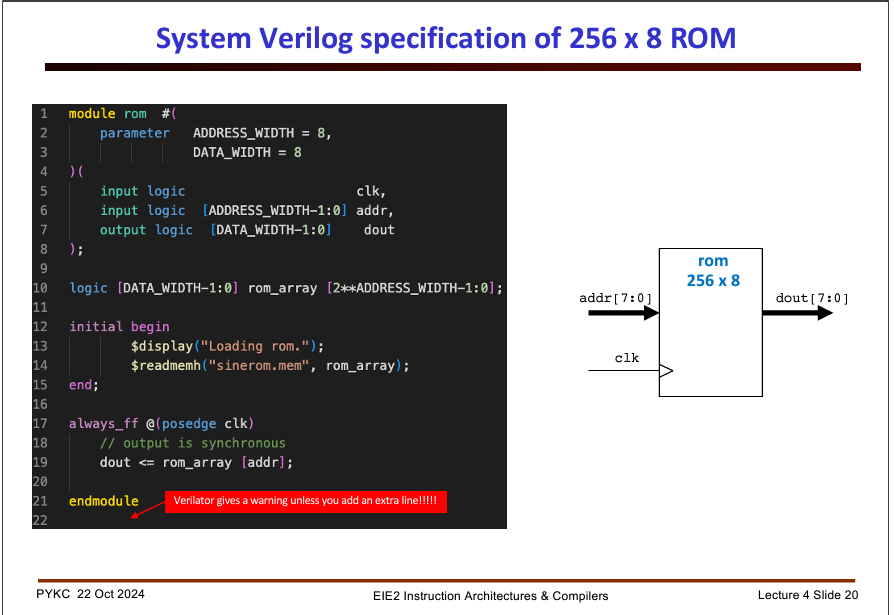
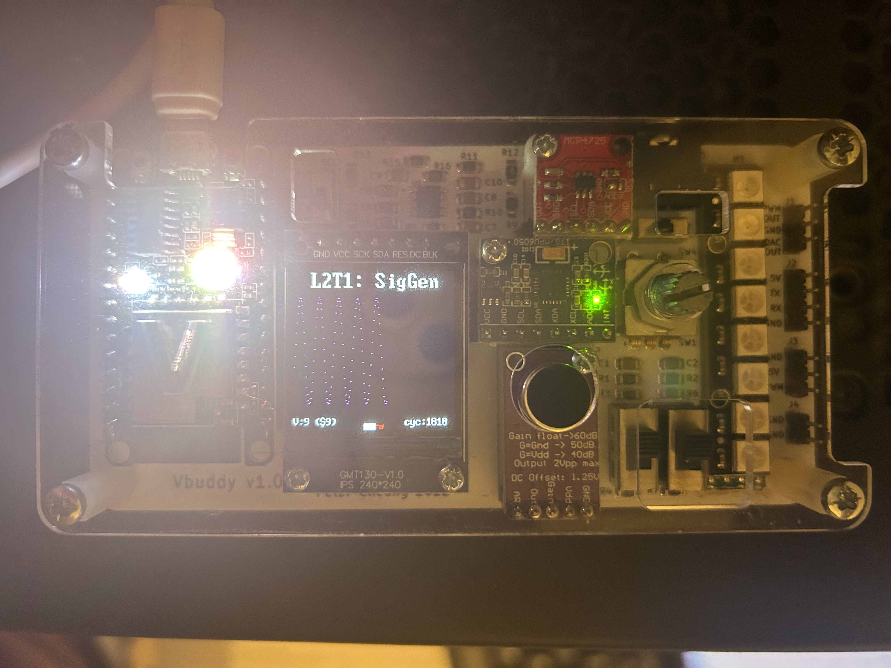
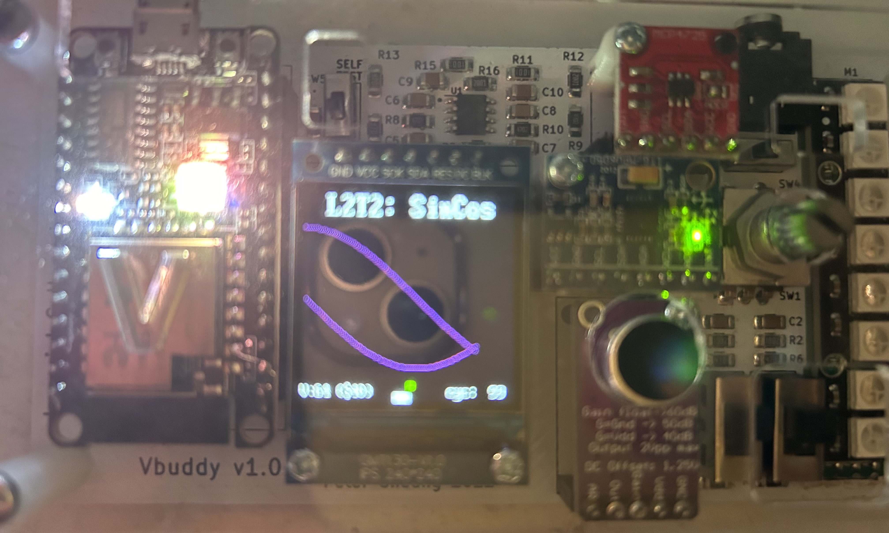
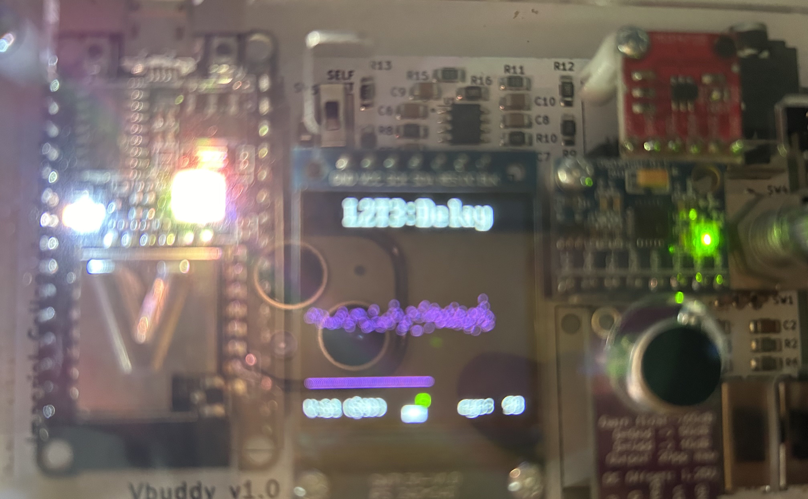

# IAC Logbook: Lab 2

## Table of contents
- [Task 1](#task-1)
- [Task 2](#task-2)
- [Task 3](#task-3)

### Task 1
Task 1 is to produce sinegen module, combining a ROM and a counter to cycle through values stored inside the ROM.

Using the ROM model given to us in the lecture:


we arrive at the following Verilog:
```Verilog
module rom #(
    parameter ADDRESS_WIDTH = 8,
              DATA_WIDTH = 8
) (
    input logic clk,
    input logic [ADDRESS_WIDTH-1:0] addr,
    output logic [DATA_WIDTH-1:0] dout
);

    logic [DATA_WIDTH-1:0] rom_array [2**ADDRESS_WIDTH-1:0];

    initial begin
        $display("Loading rom");
        $readmemh("sinerom.mem", rom_array);
    end

    always_ff @(posedge clk) begin
        dout <= rom_array[addr];
    end

endmodule
```

The sampled sine values are produced from the given Python script, and written to sinerom.mem, where it is the loaded into the ROM during model initialisation.

Below is the whole design working, producing a sine wave at 9Hz:



### Task 2
In task 2, we are told to use a dual port ROM to allow for a second waveform offset from the first. Hence addr1 stays as it was before, but now the testbench uses
vbdValue() to offset addr2.

```Verilog
module rom #(
    parameter ADDRESS_WIDTH = 8,
              DATA_WIDTH = 8
) (
    input logic clk,
    input logic [ADDRESS_WIDTH-1:0] addr1,
    input logic [ADDRESS_WIDTH-1:0] addr2,
    output logic [DATA_WIDTH-1:0] dout1,
    output logic [DATA_WIDTH-1:0] dout2
);

    logic [DATA_WIDTH-1:0] rom_array [2**ADDRESS_WIDTH-1:0];

    initial begin
        $display("Loading rom");
        $readmemh("sinerom.mem", rom_array);
    end

    always_ff @(posedge clk) begin
        dout1 <= rom_array[addr1];
        dout2 <= rom_array[addr2];
    end

endmodule
```
```Verilog
module sinegen (
    input   logic clk,
    input   logic en,
    input   logic rst,
    input   logic [7:0] incr,
    input   logic [7:0] offset,
    output  logic [7:0] dout1,
    output  logic [7:0] dout2,
);
    wire [7:0] count;
    counter #(8) counter_0 (clk, rst, en, incr, count);
    rom #(8, 8) rom (clk, count, count+offset, dout1, dout2);
endmodule
```
```C++
#include "verilated.h"
#include "verilated_vcd_c.h"
#include "Vsinegen.h"

#include "vbuddy.cpp"    
#define MAX_SIM_CYC 1000000

int main(int argc, char **argv, char **env) {
  int i;     
  int clk;       

  Verilated::commandArgs(argc, argv);
  // init top verilog instance
  Vsinegen* top = new Vsinegen;
  // init trace dump
  Verilated::traceEverOn(true);
  VerilatedVcdC* tfp = new VerilatedVcdC;
  top->trace (tfp, 99);
  tfp->open ("sincos.vcd");
 
  // init Vbuddy
  if (vbdOpen()!=1) return(-1);
  vbdHeader("L2T2: SinCos");
  //vbdSetMode(1);       

  // initialize simulation inputs
  top->clk = 1;
  top->rst = 0;
  top->en = 1;
  top->incr = 1; // constant increment of 1

  // run simulation for MAX_SIM_CYC clock cycles
  for (i=0; i<MAX_SIM_CYC; i++) {
    // dump variables into VCD file and toggle clock
    for (clk=0; clk<2; clk++) {
      tfp->dump (2*i+clk);
      top->clk = !top->clk;
      top->eval ();
    }
    
    top->offset = vbdValue(); // offset controlled by rotary on Vbuddy.
    
    vbdPlot(int (top->dout1), 0, 255);
    vbdPlot(int (top->dout2), 0, 255); // This is the second data out of the ROM.
    vbdCycle(i+1);

    // either simulation finished, or 'q' is pressed
    if ((Verilated::gotFinish()) || (vbdGetkey()=='q')) 
      exit(0);                // ... exit if finish OR 'q' pressed
  }

  vbdClose();     // ++++
  tfp->close(); 
  exit(0);
}
```

As shown below this design works:



### Task 3
Next up came storing audio and reading it out in a delayed manner. This can be accomplished with a dual port RAM.
```Verilog
module ram #(
    parameter ADDRESS_WIDTH = 8,
              DATA_WIDTH = 8
) (
    input logic clk,
    input logic rd_en,
    input logic [ADDRESS_WIDTH-1:0] rd_addr,
    output logic [DATA_WIDTH-1:0] dout,
    input logic wr_en,
    input logic [ADDRESS_WIDTH-1:0] wr_addr,
    input logic [DATA_WIDTH-1:0] din
);

    logic [DATA_WIDTH-1:0] ram_array [2**ADDRESS_WIDTH-1:0];

    always_ff @(posedge clk) begin
        if (rd_en) begin
            dout <= ram_array[rd_addr];
        end
        if (wr_en) begin
            ram_array[wr_addr] <= din;
        end
    end

endmodule
```
Now the write port of the RAM is controlled by the variable delay, hence the appearance as shown below:



where it appears cut off at the beginning from the microphone signal, but then starts after 64 cycles (as that is the vbdValue here).